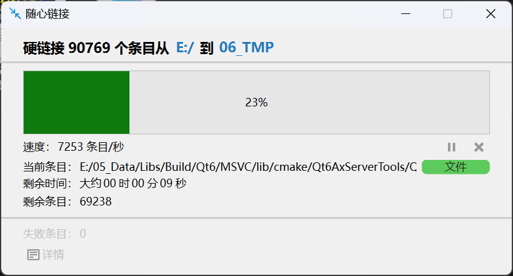
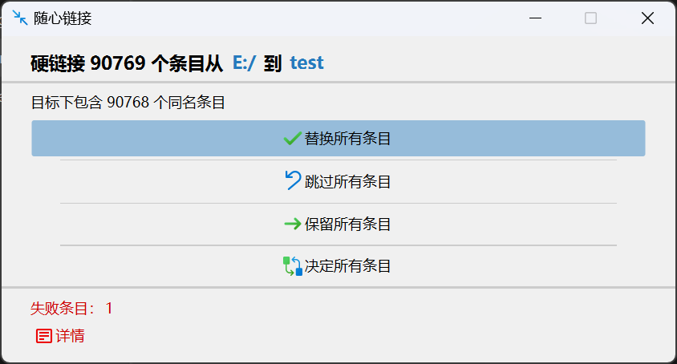
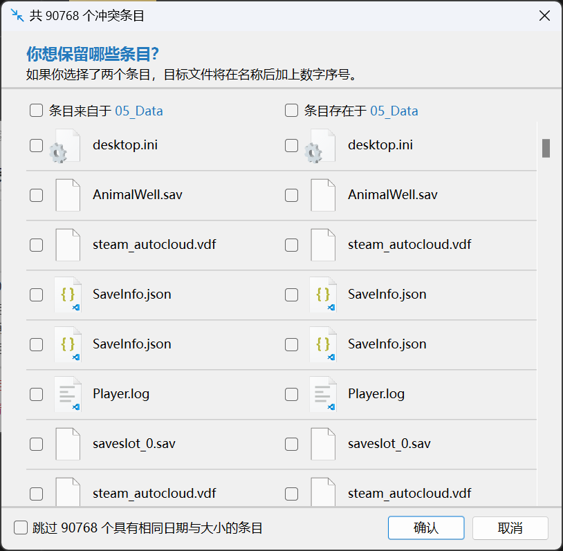

# Easy Links

**[中文 | [English](doc/README_EN.md)]**

易于使用的文件链接工具，通过可视化界面，全局快捷键，帮助您轻松创建文件/文件夹的符号链接与硬链接。

## 初衷

作为一个赛博仓鼠，我喜欢收集各种电子文件。当收集的文件数量多起来后我需要对它们进行分类。就目前而言，我使用文件夹作为标签，将每个文件放在它们应属的标签文件夹下。然而有许多文件可能同时具备多个标签，在此时如果仅仅对文件进行复制的话会造成大量的磁盘空间浪费。所以我开发了这款小工具用来解决我的问题。

## 注意点

- 文件夹不支持创建硬链接，所以当你尝试对一个文件夹进行硬链接时，程序会遍历文件夹下所有文件，并以相同的目录结构硬链接每个文件至目标路径。
- 大多数文件系统不支持跨盘硬链接。对于符号链接，如果盘符发生改变可能导致符号链接失效。

## 应用截图

