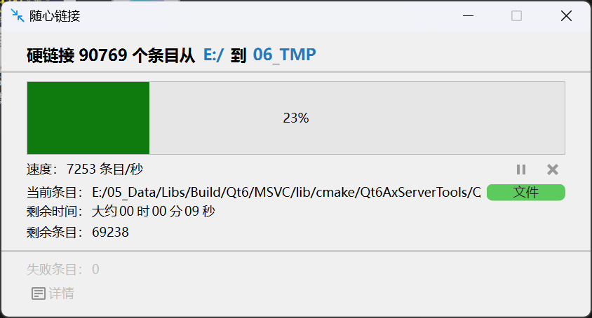
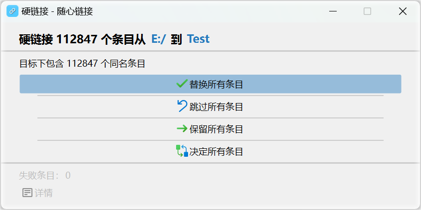
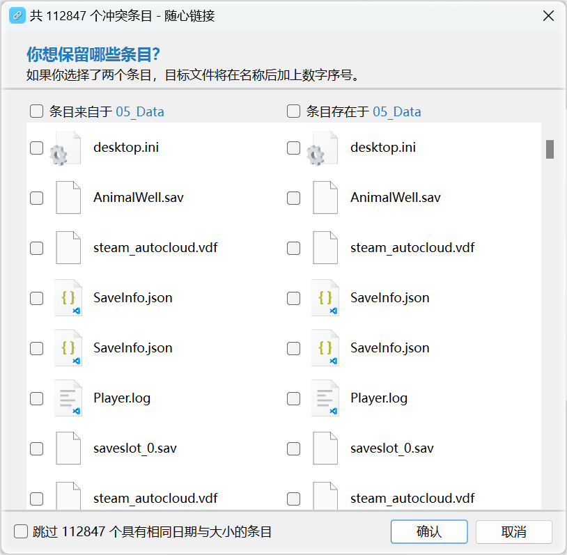

# 随心链接 Easy Links

中文 | [English](doc/README_EN.md)

随心链接是一个面向桌面文件管理器的链接工具，支持符号链接、硬链接与 Pattern Link。通过 GUI 与全局热键，快速整理文件并减少重复占用。

支持平台：Windows、macOS

## 功能概览

- 通过全局热键把剪贴板中的条目快速链接到目标目录
- Pattern Link：递归扫描目录，按规则分组并批量硬链接
- 支持执行前 Review 审核
- 冲突策略：替换、跳过、保留并自动重命名
- 可配置重命名模板、失败后窗口行为、删除时是否移动到回收站
- 三个可配置全局热键：符号链接、硬链接、Pattern Link

## 构建

请先确保 Qt 开发环境配置正确。

```bash
git clone https://github.com/jaderochan/EasyLinks
cd EasyLinks
git submodule update --init --recursive
cmake -B build -DCMAKE_BUILD_TYPE=Release
cmake --build build -j --config Release
```

## 使用说明

### 符号链接 / 硬链接

1. 在文件管理器中选中并复制条目。
2. 将焦点切换到目标目录窗口。
3. 触发全局热键：

    - Windows 默认：Ctrl+S（符号链接）、Ctrl+H（硬链接）
    - macOS 默认：Option+S（符号链接）、Option+H（硬链接）

说明：目录本身不支持硬链接。对目录执行硬链接时，程序会递归处理其内部文件并在目标目录重建对应层级。

### Pattern Link

两种入口：

- 托盘菜单打开目录选择窗口后执行
- 直接使用 Pattern Link 全局热键执行

Pattern Link 默认热键：

- Windows：Ctrl+Alt+P
- macOS：Option+Command+P

在 macOS 上，通过 Pattern Link 热键触发时，会读取前台 Finder 窗口所在目录作为输入目录。

## Pattern 模式

- 浅层匹配：按文件名、大小、权限分组
- 哈希匹配：按文件内容哈希分组

Review 阶段可手动筛选候选项，然后再执行链接。

## 重命名模板

默认模板：@ (#)

可用占位符：

- @：原文件名
- #：数字序号

注意：@ 与 # 均为必填占位符。需要输出字面量占位符时，可使用反斜杠进行转义。

示例：

- 输入文件：file.ext
- 模板：@-linked-#
- 可能输出：file-linked-1.ext

## 注意事项

- 硬链接通常不能跨文件系统或跨卷
- 符号链接在源路径变化后可能失效
- macOS 下 Pattern Link 热键要求前台应用为 Finder；若 Finder 无窗口会直接报错并终止

## 应用截图




