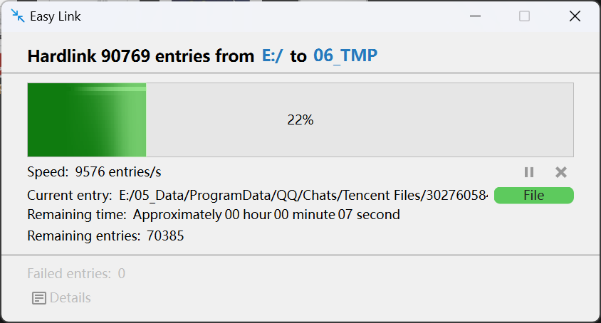
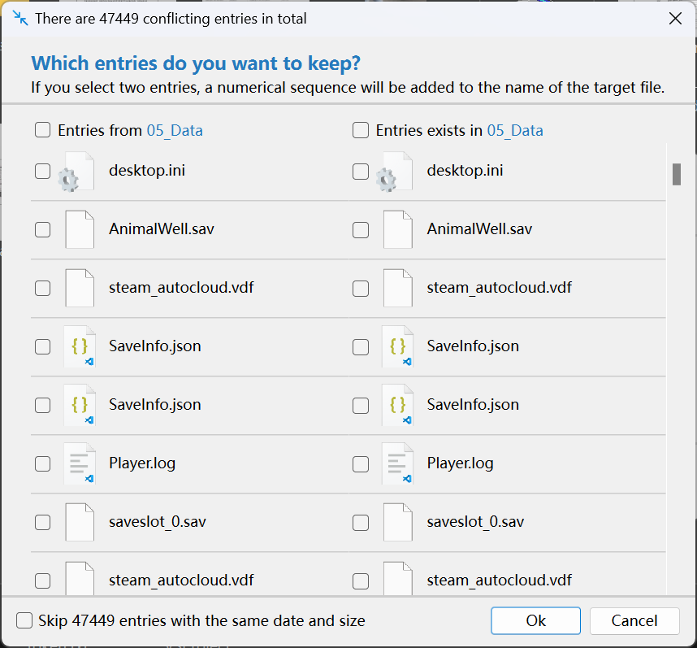

# Easy Links

**[[中文](README_ZH.md) | English]**

An easy-to-use file linking tool, through a visual interface and global shortcut keys, helps you easily create symbolic links and hard links for files/folders.

## Notes

- Folders do not support creating hard links. So when you try to create a hard link to a folder, the program will traverse all the files under the folder and hard link each file to the target path with the same directory structure.

## Application Screenshots

