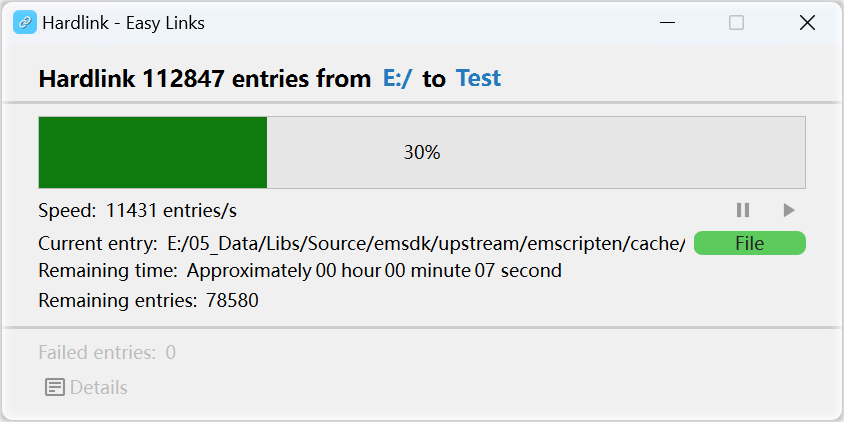
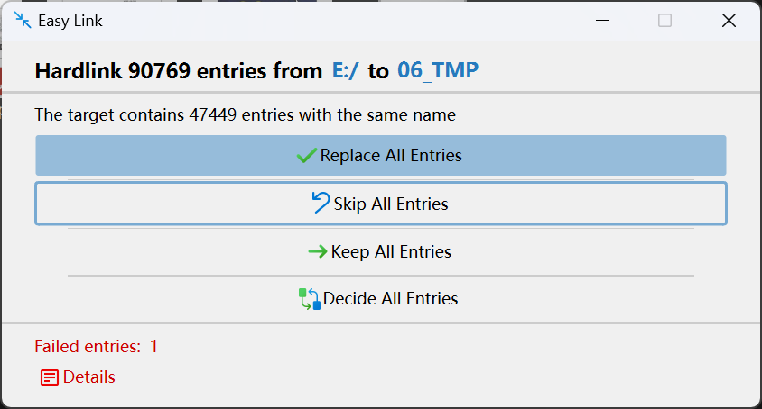
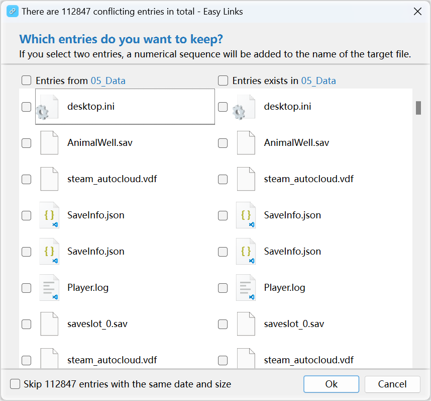

# Easy Links

**[[中文](README_ZH.md) | English]**

An easy-to-use file linking tool, through a visual interface and global shortcut keys, helps you easily create symbolic links and hard links for files/folders.

Support Windows and MacOS!

## Mind

As a cyber hamster, I enjoy collecting all kinds of electronic files. When the number of files I collect increases, I need to categorize them. For now, I use folders as tags and place each file under the tag folder it belongs to. However, many files may have multiple tags at the same time. At this point, merely copying files would result in a significant waste of disk space. Therefore, I developed this small tool to solve my problem.

## Application Usage

In the file Manager, select multiple entries (files/folders) and copy them. In the target directory you want to link to, press **Ctrl+H** or **Ctrl+S** to perform hard link or symbolic link operations (the shortcut keys can be changed).

## Notes

- Folders do not support creating hard links. So when you try to create a hard link to a folder, the program will traverse all the files under the folder and hard link each file to the target path with the same directory structure.
- Most file systems do not support hard linking across disks. For symbolic links, if the drive letter changes, it may cause the symbolic link to become invalid.

## File Rename Pattern

The default pattern is `@ (#)`.

### Available placeholders

- `@`: Original file name
- `#`: A number

If you need to insert a placeholder, you can use a backslash `\` to escape the placeholder.

The placeholders `@` and `#` are necessary.

### Example

Original file `file.ext` rename via pattern `@-linked-#` maybe produce new file name `file-linked-1.ext`

## Application Screenshots

