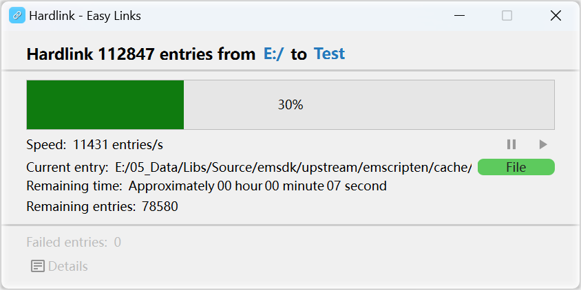
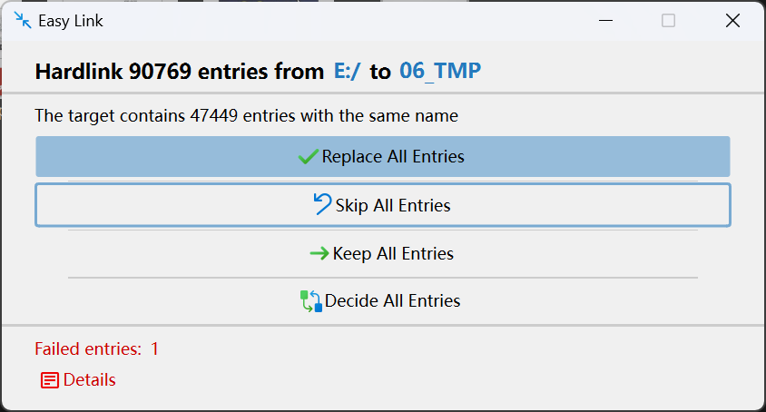
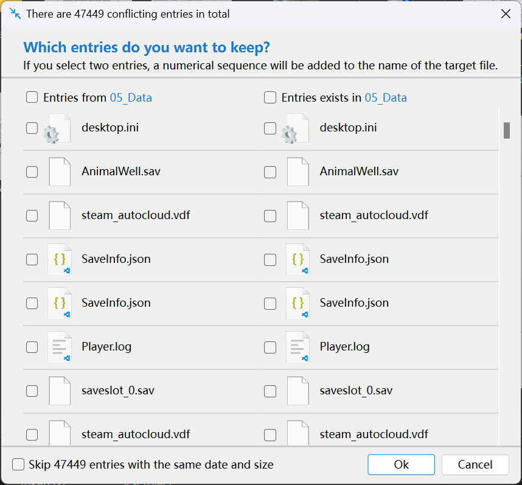

# Easy Links

[中文](README_ZH.md) | English

Easy Links is a desktop file-link utility for symbolic links, hard links, and Pattern Link workflows. It provides a GUI and global hotkeys to organize files with less duplication.

Supported platforms: Windows, macOS

## Features

- Create symbolic links or hard links from clipboard-selected file manager entries
- Pattern Link: recursively scan directories, group files by rules, then batch hard-link
- Optional review step before execution
- Conflict strategies: replace, skip, keep and auto-rename
- Configurable rename pattern, error dialog behavior, and remove-to-trash behavior
- Three configurable global hotkeys: symlink, hardlink, Pattern Link

## Build

Ensure Qt is configured correctly.

```bash
git clone https://github.com/jaderochan/EasyLinks
cd EasyLinks
git submodule update --init --recursive
cmake -B build -DCMAKE_BUILD_TYPE=Release
cmake --build build -j --config Release
```

## Usage

### Symlink / Hardlink

1. Select and copy entries in your file manager.
2. Focus the target directory window.
3. Trigger global hotkeys:

    - Windows defaults: Ctrl+S (symlink), Ctrl+H (hardlink)
    - macOS defaults: Option+S (symlink), Option+H (hardlink)

Note: directories cannot be hard-linked directly. For directory hardlink workflow, Easy Links recursively hard-links files and recreates structure in target.

### Pattern Link

Two entry points:

- Tray menu and directory picker
- Global hotkey directly

Pattern Link hotkey defaults:

- Windows: Ctrl+Alt+P
- macOS: Option+Command+P

On macOS, Pattern Link hotkey reads the focused Finder window path as input directory.

## Pattern Modes

- Superficial mode: group by file name, size, permissions
- Hash mode: group by file content hash

During review, you can keep or exclude candidates before execution.

## Rename Pattern

Default: @ (#)

Placeholders:

- @: for original filename
- #: for numeric sequence

Both placeholders are required. Use backslash to escape placeholder characters when needed.

Example:

- Input: file.ext
- Pattern: @-linked-#
- Possible output: file-linked-1.ext

## Notes

- Hard links usually cannot cross file systems or volumes
- Symbolic links may break if source paths change
- On macOS, Pattern Link hotkey requires Finder to be frontmost; if no Finder window exists, operation aborts with error

## Screenshots




